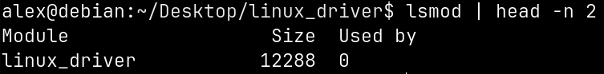
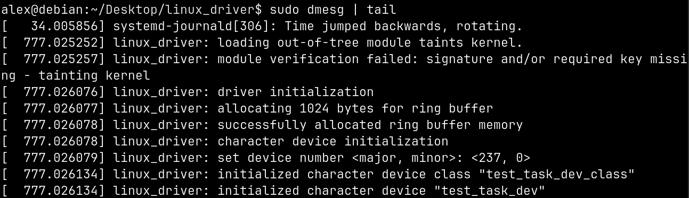

# linux_driver
Test task: Implementation of Linux driver

## Description:

Задание 2. Linux kernel

Реализовать символьный драйвер предлагающий возможность передавать информацию двум независимым процессам через файл символьного устройства: 

 - взаимодействие должно осуществляться по принципу кольцевого буфера;  т.е. один процесс может писать в файл символьного устройства, а другой из него читать. 

- обеспечить возможность задавать размер кольцевого буфера через механизм параметров модулей ядра; 

- по умолчанию вызовы чтения и записи должны быть блокирующими; 

- обеспечить поддержку нескольких вызовов IOCTL: 
  
  - переключение режима работы вызовов read\write из блокирующих \ не блокирующих и обратно; 
  
  - обеспечить возможность получения информации о времени последней операции чтения и записи в буфер, а так же идентификаторов и владельцев процессов совершивших эту операцию;
  
  - драйвер должен собираться вне дерева исходных кодов ядра при помощи Makefile; 
 
 - исходные коды драйвера должны находиться под системой контроля версий git и содержать историю коммитов; 
 
 - результат передаётся в виде ссылки на репозиторий размещённый на github или в виде архива содержащего репозиторий с исходными кодами.

## Installation

Clone this repository
```shell
git clone https://github.com/alkuzin/linux_driver.git
```

Move to project directory and run build driver:
```shell
cd linux_driver/ && make all
```

Initialize driver (root rights required):
```shell
make init
```

Initialize driver with custom size of ring buffer (1024 bytes by default):
```shell
sudo insmod src/linux_driver.ko buffer_size=<custom buffer size>
```

To deinitialize driver (root rights required) run:
```shell
make deinit
```

To return project to original state:
```shell
make fclean
```

## Test

To check that driver loaded successfully:
```shell
lsmod | head -n 2
```


To see driver logs run:
```shell
sudo dmesg | tail
```


To test driver run:
```shell
make make_test
```

Then move to `test/` directory and run `reader` and `writer` in separate terminals:
```shell
cd test/ && ./reader
```
```shell
cd test/ && ./writer
```

To return project test to original state:
```shell
make clean_test
```